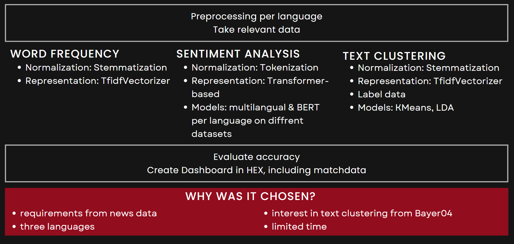

# Welcome to sentiment analaysis for Bayer04 Leverkusen news repository

## Our Mission
We aim to understand and tap into the public sentiment towards players, attract sponsors by showcasing the value of the team, and provide valuable insights for talent scouting.
The main questions asked to us by Bayer04 were:
* What is the sentiment per player per language? 
* How does the sentiment change over time, especially with regards to matches?
* What are the most frequent words per player per language?
* What topics do news talk about most per player per language?
* How do the topics change over time and especially in respect to sentiment?
Generally they were also interested in how many articles are there per player per language over time.

### Understanding public sentiment per player
We use sentiment analysis techniques to dive deep into public soccer news and discover what public sentiment towards players. By understanding trends, we help the club form stronger connections with their supporters, building fan attraction and loyalty that goes beyond the pitch. 
We use clustering techniques to understand different public sentiments and identify common themes among them. This way, we can give Bayer04 more detailed insights into what their fans love and what they're concerned about. 

## Approach
 

## Content

### Folder structure
In this repository there are the folders archive, data_files, data_gathering_preprocessing, sentiment_analysis and text_clustering. 
Additionally there are the README.md file, which explains this repository, and the utils.py file, which inlcudes all functions. 

### archive
This folder includes old versions of the data and model files. This is not relevant for grading. Rather it documents development steps and experiments, which were stopped troughtout the process, for Bayer04 in case they want to move forward with this project.

### data_files
data_files includes all the csvs that are generated and used in the files of this repository and the dashboard:
* all_data_v3.csv is generated using the update_data file in data_gathering_preprocessing. It was last updated on the 30th of May 2023.
* match_info_players.csv is a csv provided by Bayer04 to us. It is used to visualize the match dates and results in HEX.
This folder is structured with three subfolders: 
* data_clean includes all the files that were generated by the preprocessing files. Bayer04 asked us to make sure not to loose any data (clean_1) and store one most clean version of the data (clean_2), which is why there are more files than the ones used for further anylsis. data_clean also includes the folder labeled-data which contains the preprocessed data which was then manually labeled (see next paragraph) for sentiment and kmeans clustering. 
* data_clustering includes the newest files that were generated troughout the clustering process by the diffrent models as well as the word frequencies result for all players and all languages. It also includes a csv that combines the kmeans result and the sentiment result, because this csv is needed for the dashboard in HEX.
* data_sentiment contains the file that includes the results from the multilingual sentiment model for all three languages.

#### Labeled data
As the original data retrieved from the API and parsed hmtls wasn't labeled, this was done manually. 
For sentiment per language 30 datapoints were labeled. The goal was to have an as much balanced support as possible to make the evaluation comparable. This was achieved for sentiment for the German and Spanish data. The English data didn't include enough negativ datapoints, which is why only four datapoints could be labeled negative and therefore 13 were labeled as positive and 13 as neutral. 
For text clustering only the German data was labeled. Accidentally the topic Bundesliga-News was labled with one more datapoint than Europa-League and and Situation & Match Performance. Which leads to 31 labeled datapoints in total for text clustering.

### data_gathering_preprocessing
This folder contains the update_data file which is used to extract the relevant urls using the API and parsing the htmls using BeautifulSoup4. 
The three other files are used for preprocessing. As there are a number of preprocessing steps there is one file per language. Also there is additonal preprocessing for the text clustering that is exclusively performed in the German preprocessing file.

### sentiment_anlysis
There are two files in this folder: The file with the multingual bert model that is used for the dashboard in HEX and the file for the other sentiment models per language that were explored. Both files include the evaluation of the performance per model. 

### text_clustering
This folder includes the word_frequencies file that calculates absolute frequencies, as requested by Bayer04, per language and per player. 
The main subject of this folder is adressed in the text_clustering file, which uses kMeans and shows how the topics were named manually. It examines cluster dirstributions and prediction probabilities per cluster, tests the accuracy per cluster with the manually labeled data and creates wordclouds. This file also includes the LDA model and explains why it wasn't chosen for the dashboard in HEX. 

### Files used for the dashboard in HEX

**all_data_v3.csv**

This file contains the original data pulled from the urls, it is not yet cleaned. We use it in HEX to show the original data we gather form the beggining.

**data_sentiment_final.csv**

This file contains the cleaned and processed data, including a sentiment score and label. With information on players, languages, dates, sentiment, and other relevant details, it serves as the basis for dynamic dashboards in HEX. These dashboards enable users to explore the average sentiment per player, period of time, and language.

**word_frequencies.csv**

This file contains the absolute frequency of words per player and language. It is used in HEX to create dashboards that highlight the most frequent words used by each player and language.

**match_info_players.csv**

This file was provided by Bayer04 and contains match information, including the opposing team, number of goals scored, and the players who scored them. In HEX, we utilized this data in combination with sentiment information to establish a relationship between the match status and sentiment.

## Usage

Files to run to get to final generated files

1. update_data.ipynb in data_gathering_preprocessing to update all_data_v3.csv

2. preprocessing_language.ipnyb in in data_gathering_preprocessing to create language_clean_1.csv, language_clean_1_sen.csv, language_clean_2.csv, language_clean_condensed.csv and the en_clean_con_sen.

3. sentiment_bert_multilingual.ipynb in sentiment_analysis to create data_sentiment_final.csv.

4. text_clustering.ipynb in text_clustering to generate the de_clustering_model_final aswell as the csvs clustered_data_kmeans_de_v2.csv, lda_data_de_v1.csv and the combined csv clustered_data_kmeans_plus_sentiment_de.csv.

5. word_frequencies.ipynb in text_clustering to generate word_frequencies.csv.

## Final considerations
Overall we were able to answer all questions asked by Bayer04. In consultation with Bayer we applied a broader course of action to cover all three approaches (sentiment, word frequencies and text clustering) and explore different models within each, rather than focusing on one approach or one model and improving it. In each file we provided a summary of our contribution and next steps for Bayer04.

